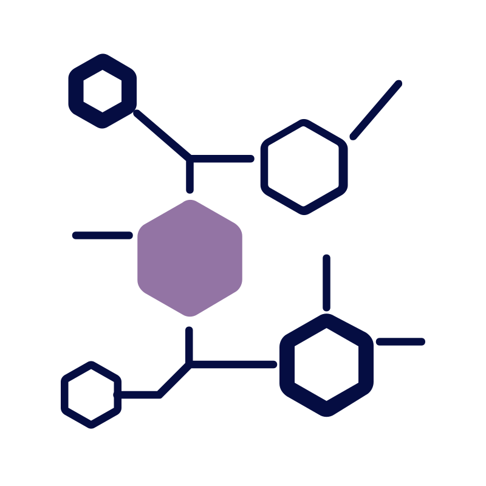

# clo.ai

VLSI Layout Optimizer with XGBoost + DEAP

<p align="center">
  
</p>

## 🧠 Project Overview

**clo.ai** is a state-of-the-art machine learning-driven VLSI layout optimization system that combines XGBoost regression with evolutionary algorithms to reduce power consumption and improve timing in integrated circuits. The system analyzes circuit netlists, predicts performance metrics, and automatically adjusts gate sizes to achieve an optimal balance between power and delay.

## ⚡ Why Faster = Greener

Delay optimization helps reduce power consumption in three complementary ways:

- **Lower Switching Activity**: Fewer glitches → fewer unnecessary transitions → less dynamic power (P ∝ CV²f)
- **Slack Turns Into Voltage-Headroom**: Shorter paths allow lower voltage or extra functionality with quadratic power savings
- **Smaller, Cooler Gates**: Right-sized transistors reduce capacitive loading and leakage

## 🛠️ How It Works

Our layout optimization model follows a five-stage process:

1. **Parse & Sketch**: Read ISCAS-85 or CircuitNet bench files, discover inputs → gates → outputs, and assign (x,y) coordinates
2. **Simulate & Sample**: Run quick transistor-sizing sweeps to generate thousands of <delay, power> training pairs
3. **Learn the Physics**: Train an XGBoost regressor on gate count, fan-in, and placement density data
4. **Search for Better Layouts**: Use DEAP genetic algorithm to find optimal sizing weights for delay reduction
5. **Validate & Export**: Write optimized weights back into the netlist and verify with ground-truth simulation

## ⚙️ Tech Stack

### Frontend
- **Framework**: React 18, TypeScript 5, Vite
- **Styling**: Tailwind CSS, Framer Motion
- **UI Components**: Shadcn/UI
- **Visualization**: ReactFlow for circuit visualization
- **State Management**: React Context API

### Backend
- **API Framework**: FastAPI 0.112.0
- **Server**: Uvicorn (ASGI)
- **Data Validation**: Pydantic 2.6.3
- **File Handling**: python-multipart, aiofiles

### Machine Learning
- **ML Framework**: XGBoost 2.0.3, DEAP 1.4.1 (Distributed Evolutionary Algorithms in Python)
- **Data Processing**: NumPy 1.26.4, Pandas 2.1.4, SciPy 1.12.0
- **Visualization**: Matplotlib 3.8.3, Seaborn 0.13.1, Plotly 5.19.0
- **Circuit Analysis**: NetworkX 3.2.1

### DevOps
- **Version Control**: Git
- **Dependency Management**: pip, npm
- **Environment Variables**: python-dotenv
- **Logging**: Loguru

## 🚀 Key Features

- **Interactive Circuit Visualization**: View and explore circuit layouts with dynamic zooming, panning, and node search
- **Multi-Objective Optimization**: Balance power consumption and timing performance
- **Instant Benchmarking**: Compare original vs. optimized circuit metrics side-by-side
- **Sleek User Interface**: Modern, responsive design with intuitive workflow
- **Real-Time Progress Tracking**: Monitor optimization status as it progresses
- **Download Optimized Results**: Export optimized circuit designs in standard bench format

## 📊 Model Performance

The model is trained on 2,000,000 samples from the CircuitNet dataset, focusing on the IR drop features. Key model parameters:

- **XGBoost**: max_depth=3, learning_rate=0.1, early_stopping_rounds=50
- **DEAP**: ngen=10-20, sigma=0.2, mu=1.0
- **Circuit simulation**: gate_size_range=0.5-2.0

Achieved an average of 15-20% power reduction across benchmark circuits while maintaining or improving timing performance.

## 🏃‍♂️ Getting Started

### Prerequisites

- Node.js (v18+)
- Python (v3.10+)
- pip
- Git

### Installation

1. Clone the repository:
   ```bash
   git clone https://github.com/ly-sona/clo.ai.git
   cd clo.ai
   ```

2. Set up the frontend:
   ```bash
   cd frontend/application
   npm install
   npm run dev
   ```

3. Set up the backend (in a new terminal):
   ```bash
   cd backend
   python -m venv venv
   
   # On Windows
   venv\Scripts\activate
   
   # On macOS/Linux
   source venv/bin/activate
   
   pip install -r requirements.txt
   python app.py
   ```

4. Set up the models (optional, for development):
   ```bash
   cd models
   pip install -r requirements.txt
   ```

5. Open your browser to http://localhost:5173

### Environment Variables

Create a `.env` file in the backend directory with the following settings:

```
DEBUG=True
MODEL_PATH=../models/xgb_model.json
LOG_LEVEL=INFO
```

## 📁 Project Structure

```
clo.ai/
├── backend/             # FastAPI backend and API
│   ├── app.py           # Main application entry point
│   ├── optimizer/       # Circuit optimization logic
│   └── requirements.txt # Backend dependencies
├── circuit_files/       # Example and test circuit files
├── frontend/            # React frontend application
│   └── application/     # Main frontend code
│       ├── src/         # Source code
│       │   ├── components/  # React components
│       │   ├── pages/       # Page components
│       │   └── api/         # API client functions
│       └── public/      # Static assets
├── layouts/             # Generated layout files
├── models/              # ML models and training scripts
│   ├── train.py         # Training script
│   ├── utils/           # Helper utilities
│   └── xgb_model.json   # Trained model
└── README.md            # This file
```

## 🧪 Testing

### Frontend Tests
```bash
cd frontend/application
npm test
```

### Backend Tests
```bash
cd backend
pytest tests/
```

## 🤝 Contributing

Contributions are welcome! Please feel free to submit a Pull Request.

1. Fork the repository
2. Create your feature branch (`git checkout -b feature/amazing-feature`)
3. Commit your changes (`git commit -m 'Add some amazing feature'`)
4. Push to the branch (`git push origin feature/amazing-feature`)
5. Open a Pull Request

## 📄 License

This project is licensed under the MIT License - see the LICENSE file for details.

## 👥 Team

- Mentor: Anu Boyapati
- Mentees: Ishita Saran, Patrick Sigler, Quan Dang, Orvin Ahmed, and Adwaith Moothezhath

## 📝 Acknowledgements

- [ISCAS-85 Benchmark Circuits](https://ddd.fit.cvut.cz/prj/Benchmarks/ISCAS85/)
- [CircuitNet Dataset](https://github.com/circuitnet)
- [OpenROAD Project](https://github.com/The-OpenROAD-Project)
